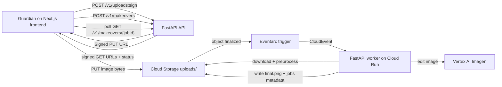

# MagicTap Kids

MagicTap Kids is a guardian-operated MVP for child-safe AI makeovers. A parent uploads one photo, picks one of five preset styles, and the app runs a cloud-backed makeover flow with direct upload, async processing, job tracking, and before/after preview.

## What the app does

- Uses a preset-driven UI only
- Avoids free-text prompts in the end-user experience
- Supports child-safe styles: Superhero, Astronaut, Royal, Jungle Explorer, and Festive
- Uploads directly to Cloud Storage using a signed URL
- Processes uploaded assets through Eventarc-triggered Cloud Run worker logic
- Edits images through Vertex AI Imagen, with a mock mode for local development
- Lets parents delete uploaded and generated assets

## Architecture



## Repo layout

```text
/frontend   Next.js 14+ app router UI
/backend    FastAPI API + worker code
/infra      gcloud deploy and Eventarc scripts
/docs       deployment notes
```

## Local setup

### 1. Frontend

```bash
cd frontend
cp .env.example .env.local
npm install
npm run dev
```

The frontend expects `NEXT_PUBLIC_API_BASE_URL=http://localhost:8000` for local development.

### 2. Backend API

```bash
cd backend
python3.11 -m venv .venv  # or python3.13 -m venv .venv if 3.11 is not installed locally
source .venv/bin/activate
pip install -r requirements.txt
cp .env.example .env
uvicorn app.main:app --reload --port 8000
```

### 3. Local worker behavior

For local development, keep `ENABLE_MOCK_AI=true`. In that mode:

- upload signing returns a local mock upload URL
- uploaded files are written under `backend/data`
- calling `POST /v1/makeovers` processes immediately once the source is present
- the Vertex layer returns a preview-style transformed image so the full UI can be exercised without cloud credentials

## Google Cloud setup

### Enable APIs

```bash
gcloud services enable \
  run.googleapis.com \
  eventarc.googleapis.com \
  artifactregistry.googleapis.com \
  cloudbuild.googleapis.com \
  storage.googleapis.com \
  aiplatform.googleapis.com
```

### Create buckets

Use one bucket or separate upload/result buckets. If using one bucket, configure both `UPLOAD_BUCKET` and `RESULT_BUCKET` to the same name.

Object layout:

- `uploads/{jobId}/source.jpg`
- `results/{jobId}/final.png`
- `jobs/{jobId}.json`

For browser-based direct uploads, apply a bucket CORS policy that allows `PUT` from your frontend origin:

```bash
cd infra
export UPLOAD_BUCKET=your-bucket-name
bash ./apply_bucket_cors.sh
```

The sample CORS policy in [infra/storage-cors.json](/Users/sonu/Documents/kids-ai-makeover-app/infra/storage-cors.json:1) includes both local development and the current Cloud Run web origin. Update the origin list before deploying to a different frontend hostname.

### Optional BigQuery image lookup

To query Cloud Storage image metadata with BigQuery SQL, create a BigQuery object table over your image bucket. Google documents object tables as metadata indexes over Cloud Storage objects with fixed columns such as `uri`, `content_type`, `size`, and `generation`.

Sample SQL template:

- [infra/create_bigquery_object_table.sql](/Users/sonu/Documents/kids-ai-makeover-app/infra/create_bigquery_object_table.sql:1)

### Environment variables

Backend:

- `GOOGLE_CLOUD_PROJECT`
- `GOOGLE_CLOUD_LOCATION`
- `BIGQUERY_PROJECT`
- `BIGQUERY_LOCATION`
- `BIGQUERY_OBJECT_TABLE`
- `UPLOAD_BUCKET`
- `RESULT_BUCKET`
- `VERTEX_IMAGEN_MODEL`
- `SIGNED_URL_EXPIRY_SECONDS`
- `ENABLE_MOCK_AI`
- `MAX_UPLOAD_MB`

Frontend:

- `NEXT_PUBLIC_API_BASE_URL`

## Deploy steps

### Backend API service

```bash
cd infra
source ./backend.env.example
bash ./deploy_api.sh
```

When the API runs on Cloud Run, signed URL generation uses the service account identity through IAM signing. Grant the API service account permission to sign blobs on itself:

```bash
gcloud iam service-accounts add-iam-policy-binding \
  "magictap-api-sa@${GOOGLE_CLOUD_PROJECT}.iam.gserviceaccount.com" \
  --member="serviceAccount:magictap-api-sa@${GOOGLE_CLOUD_PROJECT}.iam.gserviceaccount.com" \
  --role="roles/iam.serviceAccountTokenCreator"
```

### Worker service

```bash
cd infra
source ./backend.env.example
SERVICE_NAME=magictap-kids-worker bash ./deploy_worker.sh
```

### Eventarc trigger

```bash
cd infra
export WORKER_SERVICE=magictap-kids-worker
export WORKER_SERVICE_ACCOUNT=magictap-kids-worker@${GOOGLE_CLOUD_PROJECT}.iam.gserviceaccount.com
bash ./create_eventarc_trigger.sh
```

### Frontend

Deploy the Next.js app to Cloud Run or another supported Next.js host. For Cloud Run, point `NEXT_PUBLIC_API_BASE_URL` at the API service URL.

## API reference

### `POST /v1/uploads:sign`

Request:

```json
{
  "filename": "child-photo.jpg",
  "contentType": "image/jpeg",
  "sizeBytes": 482913
}
```

Response:

```json
{
  "jobId": "abc123",
  "uploadUrl": "https://...",
  "objectPath": "uploads/abc123/source.jpg",
  "expiry": 900
}
```

### `POST /v1/makeovers`

Request:

```json
{
  "jobId": "abc123",
  "presetId": "superhero"
}
```

### `GET /v1/makeovers/{jobId}`

Response:

```json
{
  "jobId": "abc123",
  "status": "completed",
  "sourcePath": "uploads/abc123/source.jpg",
  "resultPath": "results/abc123/final.png",
  "errorCode": null,
  "presetId": "superhero",
  "sourceDownloadUrl": "https://...",
  "resultDownloadUrl": "https://..."
}
```

### `DELETE /v1/makeovers/{jobId}`

Deletes the source asset, generated output, and job metadata while marking the job as deleted.

### `POST /v1/assets:query`

Queries image objects from a configured BigQuery object table using backend-generated SQL.

Request:

```json
{
  "prefix": "gs://magictap-kids-prod-assets/results/",
  "limit": 25,
  "includeSignedUrls": true
}
```

Response:

```json
{
  "sql": "SELECT uri, content_type, size, generation FROM `magictap-kids-prod.media.object_assets` ...",
  "rows": [
    {
      "uri": "gs://magictap-kids-prod-assets/results/job-123/final.png",
      "bucketName": "magictap-kids-prod-assets",
      "objectPath": "results/job-123/final.png",
      "contentType": "image/png",
      "size": 482913,
      "generation": 1713629600000000,
      "signedUrl": "https://storage.googleapis.com/..."
    }
  ]
}
```

## Notes on Vertex AI integration

- Provider-specific code is isolated in `backend/app/services/vertex_imagen.py`
- The worker applies lightweight preprocessing before editing
- Presets are deterministic and mapped internally in `backend/app/services/policy.py`
- The default model value is `imagen-3.0-capability-001`, but it is environment-configurable

## Privacy and trust UX

The UI includes:

- “For parents/guardians”
- “Delete anytime”
- “No free-text prompts”
- “Child-safe preset styles”

The app avoids claims about permanence or legal guarantees. Copy stays generic and product-safe.

## Tests

Backend starter tests:

```bash
cd backend
pytest
```

Current test coverage focuses on deterministic preset mapping, storage path behavior, and the BigQuery image-query SQL builder.

## Known limitations

- Local mode simulates the storage trigger instead of running Eventarc
- The preprocessing mask is intentionally simple and not a production segmentation system
- The Vertex request wrapper is conservative and may need small request-shape adjustments as Google evolves image editing parameters
- No auth, billing, dashboard, or moderation review queue is included in this MVP

## Next improvements

- Persist job metadata in Firestore or Cloud SQL for richer querying and auditing
- Add lifecycle rules to auto-expire raw uploads and generated assets
- Introduce stronger image quality checks and face-position guidance before upload
- Add visual regression tests and contract tests around the API
- Add optional internal-only experimentation with Gemini image flows while keeping Imagen as the primary production path
- Add authenticated admin search over BigQuery object tables and join image metadata with job records

## References

- BigQuery object tables overview: [Google Cloud documentation](https://docs.cloud.google.com/bigquery/docs/object-table-introduction)
- Create object tables: [Google Cloud documentation](https://cloud.google.com/bigquery/docs/object-tables)
